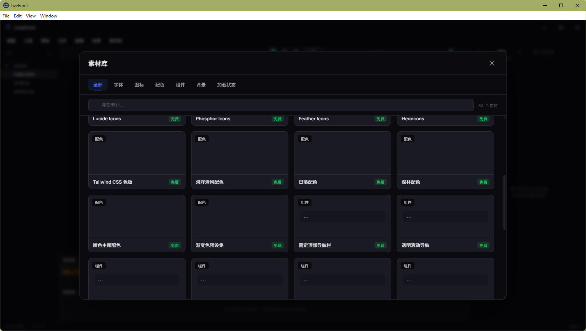
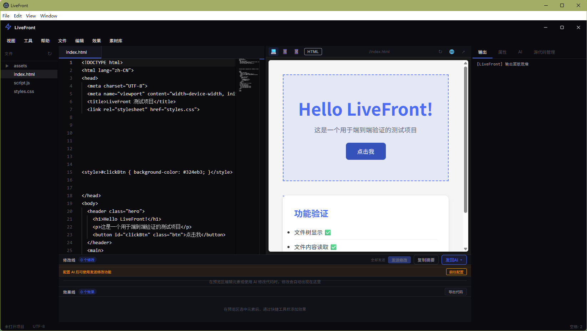
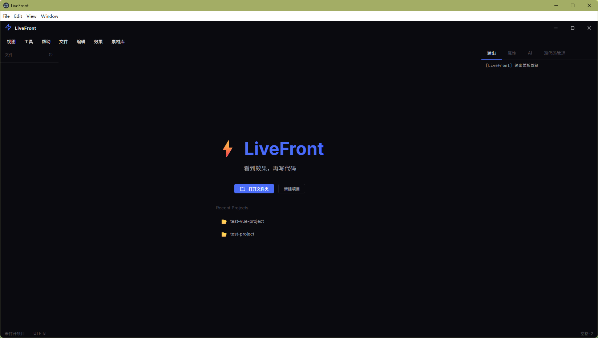
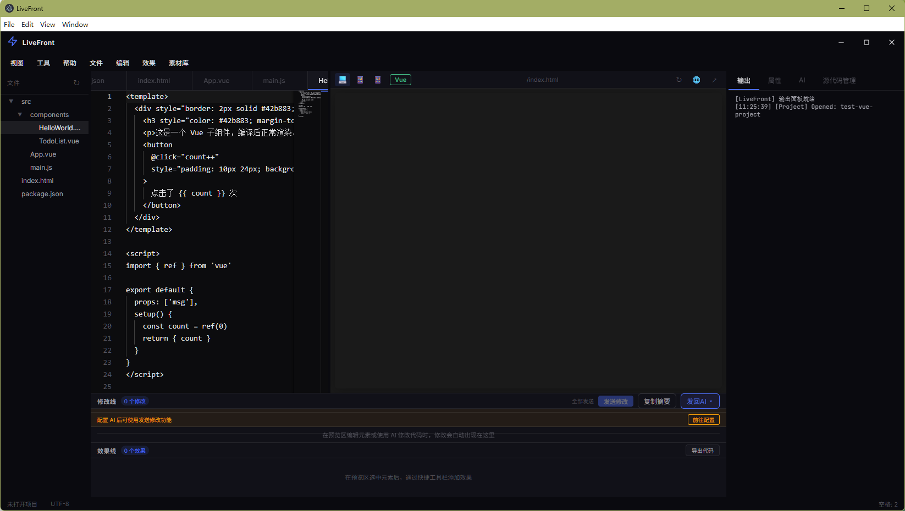
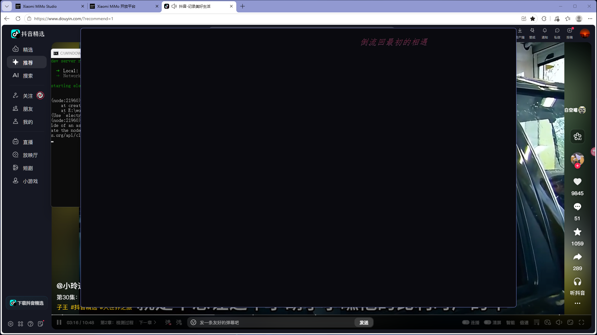
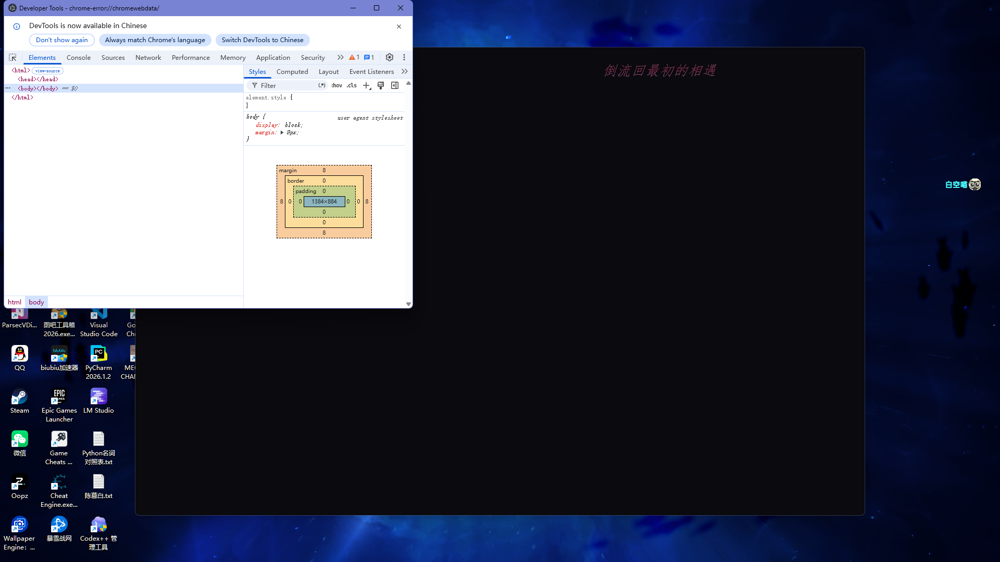
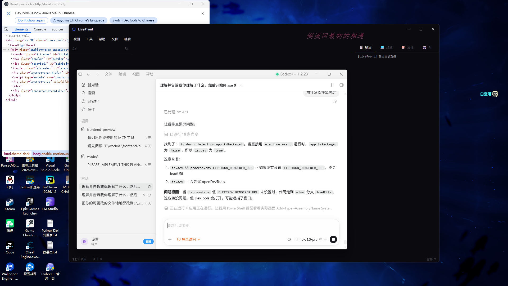

<p align="center">
  <br>
  
  <br>
</p>

<h1 align="center">LiveFront</h1>

<p align="center">
  <strong>看到效果，再写代码</strong>
</p>

<p align="center">
  <em>vibe coding 时嫌前端界面不够美，还在和 AI 说一次改一次吗？<br>
  用 LiveFront，即看即改。</em>
</p>

<p align="center">
  <a href="https://github.com/ZhangBaiKong/LiveFront/releases"></a>
  <a href="https://github.com/ZhangBaiKong/LiveFront/blob/main/LICENSE"></a>
  
  
</p>

<br>

---

## 为什么做 LiveFront

2026 年，AI 写前端代码已经很普遍了。但有一个问题始终没人解决：

> 你用 Cursor、Copilot、ChatGPT 生成了一段前端代码，复制，打开浏览器，粘贴，看一眼——不对。切回去，跟 AI 说"按钮再大一点"，再复制，再粘贴，颜色还是不对，"颜色再深一点"……反复十次。

**AI 能写代码，但从代码到好看的结果之间，缺了一座桥。**

LiveFront 就是这座桥。

传统流程：
```
AI 生成代码 → 复制 → 浏览器 → 不好看 → 切回去 → 跟 AI 说 → 重复十次
```

LiveFront 流程：
```
AI 生成代码 → 直接看到效果 → 点一下按钮 → 改个颜色 → 加个阴影 → 两分钟搞定
```

你不需要在对话框里跟 AI 反复描述"再往左移 5 像素"，你只需要点一下、拖一下、改一下。

---

## LiveFront 是什么

一个轻量级桌面编辑器，专为前端开发设计。把代码编辑、实时预览、可视化修改、AI 辅助、效果编排、素材库整合在一个界面里。

### 核心功能

<table>
<tr>
<td width="50%">

#### 编辑 + 预览并排

代码和效果放在一起。改一行 CSS，右边马上看到变化。支持桌面、平板、手机多设备尺寸切换。

</td>
<td width="50%">

#### 点击即改

点一下预览区的任何元素，右边直接显示它的所有样式属性。改颜色、改字号、改间距，不用写 CSS。

</td>
</tr>
<tr>
<td>

#### 修改线

每次改了什么都自动记录。改错了？一键回退。支持拖拽排序，可以把修改发给 AI 批量处理。

</td>
<td>

#### 效果线

选中元素，一键添加点击缩放、悬停发光、滚动渐入等交互动效。不用学 CSS 动画。

</td>
</tr>
<tr>
<td>

#### AI 对话

内置 AI 面板，支持 DeepSeek、OpenAI、Claude 等模型。自定义 API 地址，生成代码一键应用到项目。

</td>
<td>

#### 素材库

34 个免费内置素材：思源黑体、Tailwind 色板、导航栏模板、登录表单……选中直接用到项目里。

</td>
</tr>
<tr>
<td>

#### 终端

内置多标签终端，自适应大小。npm install、git commit 不用切出去。

</td>
<td>

#### Git 集成

可视化查看文件变更、暂存、提交、切换分支。Diff 对比用 Monaco DiffEditor，增删改一目了然。

</td>
</tr>
</table>

---

## 效果展示

### 最终版概念图

<p align="center">
  
</p>

### 开发截图

<p align="center">
  
</p>

<p align="center">
  
</p>

<p align="center">
  
</p>

<p align="center">
  
</p>

<p align="center">
  
</p>

<p align="center">
  
</p>

<p align="center">
  
</p>

---

## 这个项目的前景

### 为什么这个方向值得做

AI 代码生成工具在 2025-2026 年爆发式增长。Cursor、Windsurf、v0、Bolt 都在做"让 AI 更好地写代码"。但 AI 写完代码之后呢？没有人认真解决。

前端有一个独特优势：**结果是可视的。** 这意味着前端是 AI + 可视化编辑的最佳结合点。

```
AI 代码生成的市场规模：持续增长
可视化编辑工具市场：几乎空白
两者结合：LiveFront 是最早的探索者之一
```

### 目标用户

| 用户 | 场景 | 预估规模 |
|------|------|----------|
| 用 AI 写前端的开发者 | AI 代码不满意，LiveFront 里调两下 | 数百万 |
| 不会写代码但想做网页的人 | AI 生成 + LiveFront 可视化微调 | 数千万 |
| 快速做原型的前端 | 内置素材 + 效果线，几分钟出可交互原型 | 数十万 |
| 设计师 | 看到效果再决定代码怎么写 | 数十万 |

### 商业化路径

| 阶段 | 方式 | 预计时间 |
|------|------|----------|
| Phase 1 | 开源免费，积累用户 | 2026 上半年 |
| Phase 2 | 素材库高级素材 + 赞助打赏 | 2026 下半年 |
| Phase 3 | Web 版 SaaS 订阅 | 2027 |
| Phase 4 | 团队协作版 + 企业定制 | 2027+ |

### 长期愿景

```
v1.0（2026 现在）
→ 桌面编辑器，AI + 可视化 + 素材 + Git + 终端

v2.0（2026 下半年）
→ Web 版上线，浏览器直接用，零安装
→ React / Vue / Svelte 在线编译预览
→ 更多效果预设和素材

v3.0（2027）
→ 团队协作版，多人同时编辑
→ 从设计稿（Figma）直接导入
→ AI 设计师模式：描述需求，LiveFront 生成完整页面

v4.0（2027+）
→ 企业版：团队资产管理、组件库、设计系统
→ 插件市场：社区贡献效果、素材、AI 模板
→ 与主流 AI 编码工具深度集成
```

**这个赛道足够大、足够新、足够有想象空间。我们需要更多人一起把它做出来。**

---


---

## LiveFront Bridge 浏览器插件

LiveFront Bridge 是一个 Chrome 浏览器插件，让你在网页版 AI（ChatGPT、Claude、豆包）中自动发送修改摘要。

### 安装

1. 打开 Chrome 浏览器，访问 `chrome://extensions/`
2. 打开右上角「开发者模式」
3. 点击「加载已解压的扩展程序」
4. 选择 LiveFront 项目中的 `chrome-extension/` 目录
5. 插件安装完成，会在工具栏显示 LiveFront 图标

### 使用

1. 确保 LiveFront 桌面端正在运行
2. 打开 ChatGPT 或 Claude 网页
3. 插件会自动连接 LiveFront（右下角蓝色小圆点表示已连接）
4. 在 LiveFront 中修改代码后，点击「发回AI」→ 选择对应平台
5. 插件自动填入修改摘要并发送

### 工作原理

```
LiveFront 桌面端 (WebSocket :9527)
        ↕
Chrome 浏览器插件 (background.js)
        ↕
AI 网页 (content.js → 填入输入框 → 点击发送)
```

如果插件未安装，LiveFront 会自动回退到「复制剪贴板 + 打开URL」的半自动模式。
---

## 快速开始

### 下载安装

从 [Releases](https://github.com/ZhangBaiKong/LiveFront/releases) 下载最新安装包：

| 平台 | 文件 | 状态 |
|------|------|------|
| **Windows** | `LiveFront Setup x.x.x.exe` | 可用 |
| **macOS** | `LiveFront-x.x.x.dmg` | 即将支持 |
| **Linux** | `LiveFront-x.x.x.AppImage` | 即将支持 |

### 从源码运行

```bash
# 环境要求：Node.js >= 18

git clone https://github.com/ZhangBaiKong/LiveFront.git
cd LiveFront
npm install
npm run dev
```

### 打包

```bash
npm run build:win    # Windows
npm run build:mac    # macOS
npm run build:linux  # Linux
```

---

## 技术栈

```
Electron          桌面应用壳
Monaco Editor     代码编辑器（VS Code 同款引擎）
Node.js           主进程
纯 HTML/CSS/JS    渲染进程（零框架依赖）
WebView           实时预览引擎
node-pty          终端模拟
simple-git        Git 操作
electron-builder  应用打包
```

---

## 项目结构

```
LiveFront/
├── src/
│   ├── main/                # Electron 主进程
│   ├── renderer/            # 渲染进程
│   │   ├── core/            # 核心内核
│   │   │   ├── event-bus.js       事件总线
│   │   │   ├── command-registry.js 命令中心
│   │   │   ├── module-loader.js   模块加载器
│   │   │   ├── panel-manager.js   面板管理
│   │   │   ├── shortcut-manager.js 快捷键
│   │   │   ├── menu-manager.js    菜单系统
│   │   │   ├── layout-manager.js  布局管理
│   │   │   └── shared-services.js 共享服务
│   │   └── modules/         # 功能模块（可插拔拼图）
│   │       ├── filetree/      文件树
│   │       ├── editor/        代码编辑器
│   │       ├── preview/       实时预览
│   │       ├── props-panel/   属性面板
│   │       ├── modline/       修改线
│   │       ├── effectline/    效果线
│   │       ├── ai/            AI 对话
│   │       ├── materials/     素材库
│   │       ├── terminal/      终端
│   │       ├── git/           Git
│   │       └── build/         构建导出
│   └── preload/             # 安全桥接
├── resources/               # 应用图标
├── test-project/            # 测试项目
└── CONTEXT.md               # 技术文档
```

---

## 欢迎协同创作

LiveFront 正在 2026 年活跃开发阶段，我们正在寻找志同道合的人一起把它做出来。

这个项目有很多事情要做——新功能、Bug 修复、UI 优化、测试、文档、国际化——无论你的水平如何，都能找到适合你的贡献方式。

### 我们需要这样的你

**前端开发者**
- 模块开发
- UI 组件
- 交互优化
- 效果预设

**Electron 开发者**
- 主进程优化
- 原生模块集成
- 跨平台打包
- 性能优化

**设计师 / 其他**
- 界面设计
- 交互设计
- 图标设计
- 测试 / 文档 / 翻译

### 贡献流程

```
1. 去 Issues 找一个你感兴趣的任务（有 good first issue 标签的适合新手）
2. Fork 仓库
3. 从 dev 分支创建你的特性分支
4. 写代码
5. 提 PR 到 dev 分支
6. 等 review 后合并
```

不需要面试，不需要全职，每周贡献几个小时就行。

### 加入交流群

扫码加入微信群「人工智障交流群」

有问题随时讨论，有想法随时聊

<p align="center">
  
</p>

### 赞赏支持

如果 LiveFront 对你有帮助，欢迎请作者喝杯咖啡 ☕

<p align="center">
  
</p>

---

## 一句话

> 别人在 ChatGPT 里贴代码、切浏览器、来回改十次。
>
> 你用 LiveFront，AI 生成的代码直接看到效果，点一下就改好。

---

## License

GPL-3.0

Copyright © 2026 白空