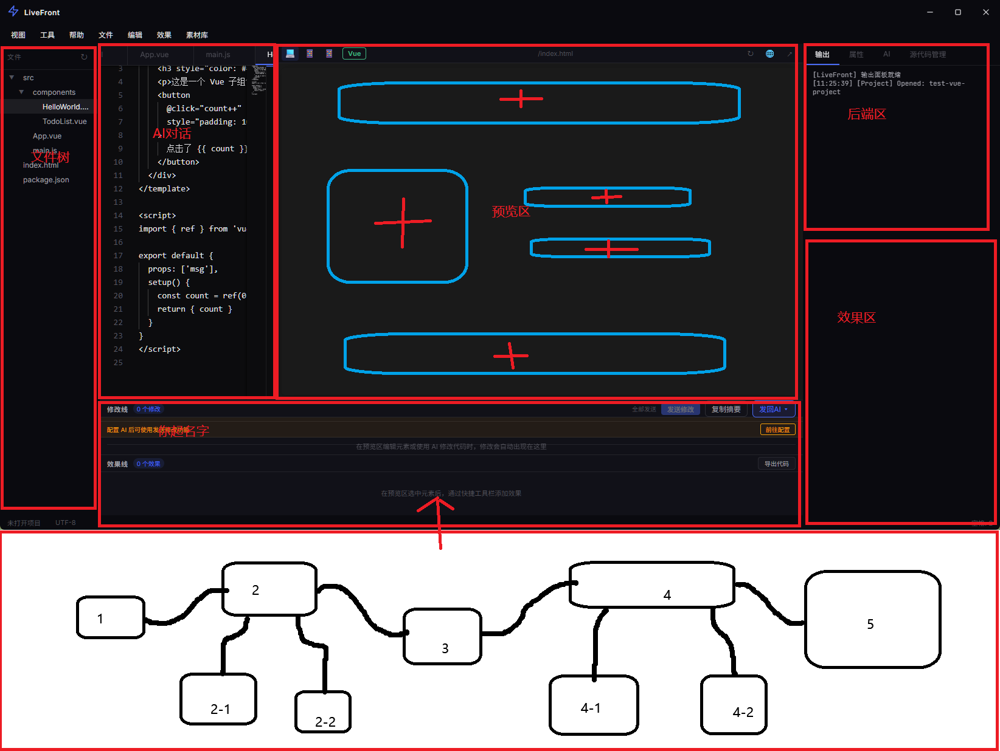
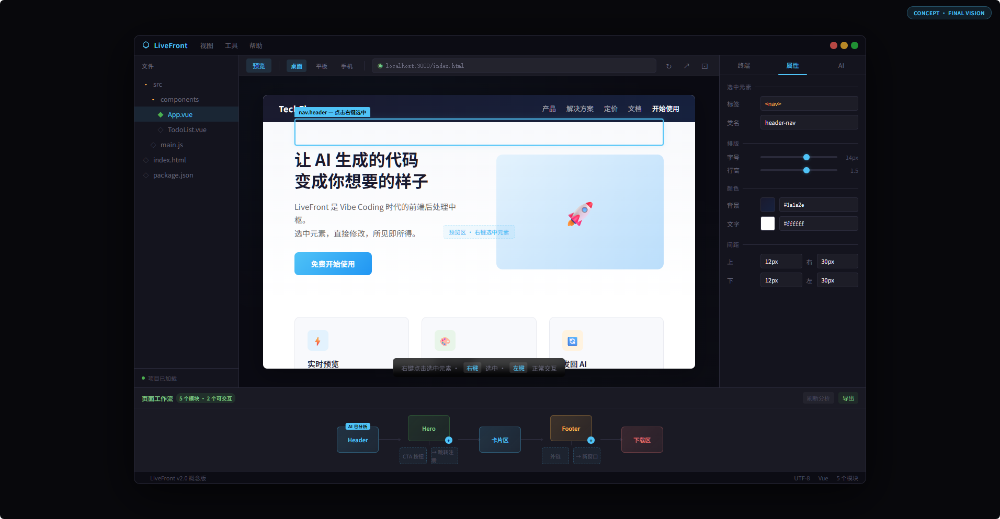

# LiveFront 项目愿景

## Vibe Coding 的断层

Vibe Coding 是 2025-2026 年兴起的编程方式：用自然语言告诉 AI，AI 直接生成完整的前端代码。Cursor、Copilot、Codex、Claude Code、ChatGPT、豆包、MiMo Code——这些工具让不会写代码的人也能做出网页。

但有一个断层没人解决：

> AI 能写代码，但从代码到好看的结果之间，缺了一座桥。

## LiveFront 做了什么

LiveFront 填补了这个断层。

**传统 Vibe Coding：** AI 生成代码 → 复制 → 浏览器 → 不好看 → 跟 AI 说 → 复制 → 浏览器 → 十次

**LiveFront：** AI 生成代码 → 直接看到效果 → 点一下按钮 → 改个颜色 → 两分钟搞定

### 核心能力

1. **代码进来，效果出来** — 打开就能看到页面，支持 React、Vue、纯 HTML，不管什么 AI 生成的代码直接渲染
2. **点一下就改，不用说** — 点元素，右边显示所有样式属性，颜色点色板，字号拖滑块，加阴影选预设
3. **改错了，一键回退** — 每步操作记录在"修改线"上，第 5 步改错点第 5 步回退，不影响后面
4. **动效不用学** — 选中元素→选效果→自动生成 CSS 注入项目
5. **AI 对话内置但不打扰** — 视觉调整点几下就搞定，复杂逻辑才需要 AI
6. **修改完发回给 AI** — 自动生成修改摘要，一键发回 Codex/Claude 等，AI 直接知道你的前端长什么样

## 最终愿景

1. **极度精简** — 代码编辑区隐藏为高级选项，主界面只留预览区和精简文件树。用户不需要看代码，甚至不需要知道代码存在
2. **AI 直接干活** — 内置 AI 像专业 Copilot 一样直接读取、修改、编写代码，不只是对话框
3. **页面模块拓扑图（核心创新）** — 底部自动生成页面的模块拓扑图，每个方块代表一个模块，自动分析交互逻辑：点击无反应的纯展示，点击有反应的会标注跳转/弹窗等交互行为

## 界面布局规划

界面分为以下区域：

- **文件树**（左侧）：极简文件树，仅显示项目根文件
- **代码编辑区**（隐藏）：折叠为高级选项，普通用户不可见
- **AI 对话区**：内置 AI，能直接读取、修改、编写代码
- **预览区**（中间主体）：网页实时预览，右键选中元素直接修改样式
- **后端区/属性区**（右侧）：双模式切换，点击后端显示终端，选中元素显示属性面板
- **效果区**（右侧下部）：选中元素后添加交互动效
- **工作流拓扑图**（底部）：自动分析页面结构，生成模块拓扑图

工作流拓扑图说明：
- 每个方块代表网页的一个模块
- 无子步骤的模块：点击无反应（纯展示）
- 有子步骤的模块：点击有反应（跳转、弹窗、下载等）
- 未识别的交互：用户点击一次后自动分析并记录

**Vibe Coding 解决了"怎么让 AI 写代码"。LiveFront 解决了"AI 写完代码之后怎么办"。**

**AI 是笔，LiveFront 是画板。**
